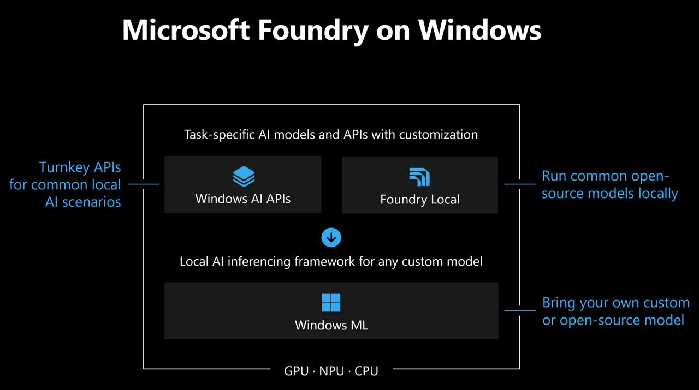

<a name="start-building"></a>
<br>
<p align="center">

</p>

# [Microsoft Build 2026](https://build.microsoft.com)

## 🔥 BRK 260: Build Apps with Local AI for Unmetered Intelligence on every Windows PC ​

### Session Description

Start with solution-centric **Windows AI APIs** - now expanding beyond Copilot+ devices. Use **Foundry Local** to run open-source models locally. With the brand new **Windows ML CLI**, as well as the **Foundry Toolkit** in VS Code extension in VS Code, optimize and prep your models for local AI deployments. Run custom AI workloads locally across GPU, NPU, or CPU with **Windows ML**, now with support for web apps through WebNN. Learn how the platform enables on-device inference across all Windows PCs to help you ship performant, scalable, and secure AI-powered apps on Windows.

<p align="center">

</p>

## 🧪 Session Demos & Getting Started

Each section below maps to a demo from the session, with links and quick steps to try it yourself.

### 🎙️ Speech Recognition API (Preview)


1. Install the **June experimental release** of the Windows App SDK (version2.1.6). This will be released soon.
2. In Visual Studio, set a dependency on your downloaded **Windows App SDK** NuGet package.
3. Build and run the solution in Visual Studio.

### 🧠 Phi Silica on GPU (Preview)

1. Install the **June experimental release** of the Windows App SDK (version 2.1.6). This will be released soon.
2. In Visual Studio, set a dependency on your downloaded **Windows App SDK** NuGet package.
3. Build and run the solution in Visual Studio.

### 🤖 Aion — Windows AI API (Preview)

1. Get the preview **Windows AI API** package for **Aion** at [aka.ms/tryAion](https://aka.ms/tryAion)
2. Or try it out today via the **Prompt API** in the latest [Microsoft Edge Canary](https://aka.ms/edge-ai-apis)

### ✨ Other Windows AI APIs (GA)

1. Install the latest [Windows App SDK release](https://learn.microsoft.com/en-us/windows/apps/windows-app-sdk/downloads) to get started
2. Browse the supported APIs — Phi Silica, Text Recognition (OCR), Image Super Resolution, Object Erase, and more — in [What are Windows AI APIs?](https://learn.microsoft.com/en-us/windows/ai/apis/)
3. Try them on your PC with the [AI Dev Gallery](https://aka.ms/ai-dev-gallery), or explore end-to-end code in the [WinUI sample](https://github.com/microsoft/WindowsAppSDK-Samples/tree/release/experimental/Samples/WindowsAIFoundry)

### 🖼️ Foundry Local - Qwen3.5 VLM (GA)

Pre-requisites - have node.js installed

1. Install foundry local - npm install foundry-local-sdk
2. From inside the foundry-local folder, run this command-  npm install
3. npm run dev
4. Browse the [Foundry Local model catalog](https://www.foundrylocal.ai/models) to explore other models you can swap in

### 🛠️ Windows ML CLI (Preview)

1. Download the Windows ML CLI and agent skills from the GitHub repository: [aka.ms/winmlcli](https://aka.ms/winmlcli)
2. Run the CLI from PowerShell or your favorite AI-powered dev environment
3. Convert, optimize and benchmark your custom model or one from Hugging Face

### ⚡ Windows ML (GA)

1. Install the latest [Windows App SDK release](https://learn.microsoft.com/en-us/windows/apps/windows-app-sdk/downloads) to get started
2. Explore the [Windows ML documentation](https://learn.microsoft.com/windows/ai/windows-ml/) for samples and API reference
3. Share feedback in the GitHub repository: [microsoft/WindowsML](https://github.com/microsoft/WindowsML)

### 🌐 WebNN (Preview)

1. Enable these experimental flags in Edge or Chrome:
   - Enables WebNN API (`#web-machine-learning-neural-network`) — Enabled
   - Enables experimental WebNN API features (`#experimental-web-machine-learning-neural-network`) — Enabled
   - ONNX Runtime backend for WebNN (`#webnn-onnxruntime`) — Enabled
2. Try the Unmetered Tokens Café sentiment classification web app running on Windows ML: [anatarnousk/Sentiment-Analysis-WinML-WebNN](https://github.com/anatarnousk/Sentiment-Analysis-WinML-WebNN)
3. Check out the samples on the [WebNN Developer Preview](https://microsoft.github.io/webnn-developer-preview/) page

### 📚 Resources

| Resource | Description |
|:---------|:------------|
| [Build 2026 next steps](https://aka.ms/build26-next-steps) | Explore lab and session repos to further your learning from Microsoft Build |
| [Windows App SDK](https://aka.ms/winappsdk) | The unified SDK that delivers Windows AI APIs and modern UI to your apps |
| Windows AI API Preview — Aion | Early-access on-device generative AI capabilities for your apps |
| [Foundry Local](https://aka.ms/foundrylocal) | Run open-source models locally on Windows with a few commands |
| [Windows ML](https://aka.ms/winml) | Microsoft's high-performance local AI inferencing framework for Windows |
| [Windows ML on GitHub](https://github.com/microsoft/WindowsML) | Official repo — file issues, browse samples, and share feedback |
| [Windows ML CLI](https://aka.ms/winmlcli) | Convert, optimize, and benchmark models from Hugging Face or your own across GPU, NPU, and CPU |
| [AI Dev Gallery](https://aka.ms/ai-dev-gallery) | Interactive samples and source code for local AI scenarios on Windows |
| [Foundry Toolkit for VS Code](https://aka.ms/foundry-toolkit) | Discover, prep, and deploy models for local AI right from the editor |
| [Microsoft Foundry on Windows overview](https://learn.microsoft.com/windows/ai/overview) | Learn how Windows AI APIs, Foundry Local, and Windows ML fit together |
| [ONNX Runtime](https://onnxruntime.ai/docs/) | API reference for the cross-platform inferencing engine that powers Windows ML |
| [ONNX Runtime Web](https://onnxruntime.ai/docs/tutorials/web/) | Framework API for running ONNX models in the browser via WebNN — backed by Windows ML on Windows for native hardware acceleration |
| [WebNN](https://aka.ms/webnn) | Web Neural Network API for hardware-accelerated ML in the browser, powered by Windows ML on Windows |
| [Hugging Face](https://huggingface.co/) | Community platform hosting thousands of open-source AI models you can bring to Windows ML |


### 🌟 Microsoft Learn MCP Server

The Microsoft Learn MCP Server gives your AI agent direct access to Microsoft's official documentation — grounded, up-to-date answers about the products and services covered in this session.

**VS Code** — One click installation: 

[](https://vscode.dev/redirect/mcp/install?name=microsoft-learn&config=%7B%22type%22%3A%22http%22%2C%22url%22%3A%22https%3A%2F%2Flearn.microsoft.com%2Fapi%2Fmcp%22%7D)


**GitHub Copilot CLI** — Run this to install the Learn MCP Server as a plugin:
```
/plugin install microsoftdocs/mcp
```

For more info, other clients, and to post questions, visit the [Learn MCP Server repo](https://aka.ms/learnmcp).

## Content Owners

<!-- TODO: Add yourself as a content owner
1. Change the src in the image tag to {your github url}.png
2. Change INSERT NAME HERE to your name
3. Change the github url in the final href to your url. -->

<table>
<tr>
    <td align="center"><a href="http://github.com/anatarnousk">
        <br />
        <sub><b>Anastasiya Tarnouskaya</b></sub></a><br />
            <a href="https://github.com/anatarnousk" title="talk">📢</a>
    </td>
    <td align="center"><a href="https://www.linkedin.com/in/aditinarvekar/">
        <br />
        <sub><b>Aditi Narvekar</b></sub></a><br />
            <a href="https://www.linkedin.com/in/aditinarvekar/" title="talk">📢</a>
    </td>
</tr></table>

## Contributing

This project welcomes contributions and suggestions.  Most contributions require you to agree to a
Contributor License Agreement (CLA) declaring that you have the right to, and actually do, grant us
the rights to use your contribution. For details, visit [Contributor License Agreements](https://cla.opensource.microsoft.com).

When you submit a pull request, a CLA bot will automatically determine whether you need to provide
a CLA and decorate the PR appropriately (e.g., status check, comment). Simply follow the instructions
provided by the bot. You will only need to do this once across all repos using our CLA.

This project has adopted the [Microsoft Open Source Code of Conduct](https://opensource.microsoft.com/codeofconduct/).
For more information see the [Code of Conduct FAQ](https://opensource.microsoft.com/codeofconduct/faq/) or
contact [opencode@microsoft.com](mailto:opencode@microsoft.com) with any additional questions or comments.

## Trademarks

This project may contain trademarks or logos for projects, products, or services. Authorized use of Microsoft
trademarks or logos is subject to and must follow
[Microsoft's Trademark & Brand Guidelines](https://www.microsoft.com/legal/intellectualproperty/trademarks/usage/general).
Use of Microsoft trademarks or logos in modified versions of this project must not cause confusion or imply Microsoft sponsorship.
Any use of third-party trademarks or logos are subject to those third-party's policies.
